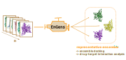

# EnGens: a computational framework for generation and analysis of representative protein conformational ensembles




Repository for the computational framework for generation and analysis of representative protein conformational ensembles.

This is joint work of [KavrakiLab](https://kavrakilab.org/) and [AntunesLab](https://dinlerantunes.com/lab/)!
___

## Demo 

Try running our demos on Google Colab: 
- Dynamic Use-Case (with a custom MD trajectory as input)
  -  [](https://colab.research.google.com/drive/1xzLulErjkvC4gIQYM1md-n7jaL6dDLKK?usp=sharing)
  -  This demo features an MD test example of a small pentapeptide
  -  You can also upload your own trajectory!
- Static Use-Case (with _UniProt ID_ as input) 
  - [](https://colab.research.google.com/drive/1rVeWH8CdUtbvmVCTZkxleRCRTe8dW5LN?usp=sharing)  
  - This demo features the `P03372` UniProt accession related to the ER-alpha estrogent receptor
  - But you can try it out with your own choice of UniProt ID too!

Try runnning our notebooks on Binder:
[](https://mybinder.org/v2/gh/KavrakiLab/EnGens/binder?labpath=Workflow1-FeatureExtraction.ipynb)


## Documentation

Check out the detailed readthedocs documentation here: https://engens.readthedocs.io/en/latest/

## Installation instructions

#### Docker image pull
The prefered and easiest is by pulling the docker image made available publicly.

**prerequisites:** [docker](https://docs.docker.com/get-docker/)

Just pull the image:

```
docker pull ac121/engens:latest
```
You're all set!

_Note: this step should not take longer than 15min. On Windows the PowerShell sometimes gets stuck - do a right click in the terminal to check the progress after 10-15min._

For other installation options check the section [Advanced Installation](#advanced-installation) bellow.

## Running EnGens

### Linux: run the following command from the working directory with this code

`docker run -it --rm -v $(pwd):/home/engen/ -p 8888:8888 ac121/engens:latest jupyter notebook --ip=0.0.0.0 --port=8888`

### Windows: run the following command from the working directory with this code

`docker run -it --rm -v ${pwd}:/home/engen/ -p 8888:8888 ac121/engens:latest jupyter notebook --ip=0.0.0.0 --port=8888`

Using these commands a link will pop up (something like `http://127.0.0.1:8888/?token=7f4fb1ded621bda931880bd3cd1c62431d47abfbb91116ac`). 
Follow this link and you will find a set of notebooks:

- `Workflow1-crystal_structures.ipynb`
- `Workflow1-FeatureExtraction.ipynb`
- `Workflow2-DimensionalityReduction.ipynb`
- `Workflow3-Clustering.ipynb`
- `Workflow4-ResultSummary.ipynb`

For static workflow start with `Workflow1-crystal_structures.ipynb` and continue with Workflow2-4.
For dynamic workflow start with `Workflow1-FeatureExtraction.ipynb` and continue with Workflow2-4. 
___

## Code

All the code and classes used in the notebooks are found in the directory `./EnGeNs/engens_code/engens/core/`

## Advanced Installation

#### 1. Docker image build
You can clone this repo and build the docker image yourself.

**prerequisites:**  [git](https://git-scm.com/book/en/v2/Getting-Started-Installing-Git), [docker](https://docs.docker.com/get-docker/)


1. Clone the github repo:

```
git clone https://github.com/KavrakiLab/EnGens.git
```

2. Build the image:

```
cd EnGens
docker build -t test_engens:latest .
```

You're all set!

#### 2. Conda environment build
If you don't want to use docker, you can clone this repo and install using conda (or mamba which will be faster).

**prerequisites:** [conda](https://docs.conda.io/projects/conda/en/latest/user-guide/install/index.html#) or [mamba](https://mamba.readthedocs.io/en/latest/installation.html)

1. Clone the github repo:

```
git clone https://github.com/KavrakiLab/EnGens.git
```

2. Install with conda (or mamba)

```
cd EnGens
conda env create -f ./environment.yaml
#mamba create -f ./environment.yml

conda activate engens
#mamba activate engens

./linux_setup.sh
#or ./windows_setup.sh
```

## Acknowledgements

EnGens relies on and/or references the following separate libraries and packages:

- Structural bioinformatics (and MD) software 
  - [MDTraj](https://www.mdtraj.org/)
  - [MDAnalysis](https://www.mdanalysis.org/)
  - [PyTraj](https://github.com/Amber-MD/pytraj)
  - [MSMTools](https://github.com/markovmodel/msmtools)
  - [PyEmma](http://www.emma-project.org/latest/)
  - [OpenMM](https://openmm.org/)
  - [HDE](https://github.com/hsidky/srv)
  - [mTM-align](https://yanglab.nankai.edu.cn/mTM-align/)
  - [BioPython](https://biopython.org/)
- Visualization 
  - [NGLViewer](http://nglviewer.org/nglview/latest/)
  - [py3Dmol](https://github.com/avirshup/py3dmol)
  - [ProtVista](https://ebi-uniprot.github.io/ProtVista/userGuide.html)
- General ML tools 
  -   [scikit-learn](https://scikit-learn.org/)
  -   [scipy](https://scipy.org/)
  -   [umap-learn](https://umap-learn.readthedocs.io/en/latest/)
- Others
  - [plotly](https://plotly.com/)
  - [pandas](https://pandas.pydata.org/)
  - [numpy](https://numpy.org/)
  
We thank all their contributors and maintainers!
___
