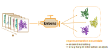

Welcome to EnGens documentation!
===================================

**EnGens** is a Python library for anyone interested in studying protein structures and their flexibility.
EnGens provides a computational framework for generation and analysis of representative protein conformational ensembles.

|EnGens Big Logo|

With EnGens you will be able to process your datasets of protein structure both:

* static (gathered from the PDB databank or modelled)
* dynamic (generated by MD simulation)

EnGens will analyze your dataset and **extract a representative ensemble** with the following steps:

1. Data loading and preprocessing
2. Data featurization
3. Dimensionality reduction
4. Clustering and ensemble extraction
5. Visualization and further analysis

You can use the resulting ensemble for downstram tasks such as docking, structural drug design or other analysis!

Contents
--------

Check out the :doc:`installation` section for further information regarding the :ref:`installation` of the project.
Check out the :doc:`workflows-description` section for detailed description of the workflows.
Finally, check out :doc:`usage` for the instructions on how to use EnGens.

.. toctree::

   installation
   workflows-description
   usage
   
Acknowledgments
--------

This work was built up on a large amount of community effort including the following tools:

* Structural bioinformatics (and MD) software 

  * `MDTraj`_
  * `MDAnalysis`_
  * `PyTraj`_
  * `MSMTools`_
  * `PyEmma`_
  * `OpenMM`_
  * `PDBFixer`_
  * `SRV`_
  * `mTM-align`_
  * `BioPython`_
  * `PDBRenum`_
  
* Visualization 

  * `NGLViewer`_
  * `py3Dmol`_
  * `ProtVista`_
  
* General ML tools 

  *   `scikit-learn`_
  *   `scipy`_
  *   `umap-learn`_
  *   `deeptime`_
  
* Others

  * `plotly`_
  * `pandas`_
  * `numpy`_
  
.. _MDTraj: https://www.mdtraj.org/
.. _MDAnalysis: https://www.mdanalysis.org/
.. _PyTraj: https://github.com/Amber-MD/pytraj
.. _MSMTools: https://github.com/markovmodel/msmtools
.. _PyEmma: http://www.emma-project.org/latest/
.. _OpenMM: https://openmm.org/
.. _SRV: https://github.com/hsidky/srv
.. _mTM-align: https://yanglab.nankai.edu.cn/mTM-align/
.. _BioPython: https://biopython.org/
.. _`PDBRenum`: http://dunbrack.fccc.edu/PDBrenum/
.. _`PDBFixer`: https://github.com/openmm/pdbfixer
.. _`NGLViewer`: http://nglviewer.org/nglview/latest/
.. _`py3Dmol`: https://github.com/avirshup/py3dmol
.. _`ProtVista`: https://ebi-uniprot.github.io/ProtVista/userGuide.html
.. _`scikit-learn`: https://scikit-learn.org/
.. _`scipy`: https://scipy.org/
.. _`umap-learn`: https://umap-learn.readthedocs.io/en/latest/
.. _`deeptime`: https://deeptime-ml.github.io/latest
.. _`plotly`: https://plotly.com/
.. _`pandas`: https://pandas.pydata.org/
.. _`numpy`: https://numpy.org/

We would like to thank the authors and the maintainers of the tools!
